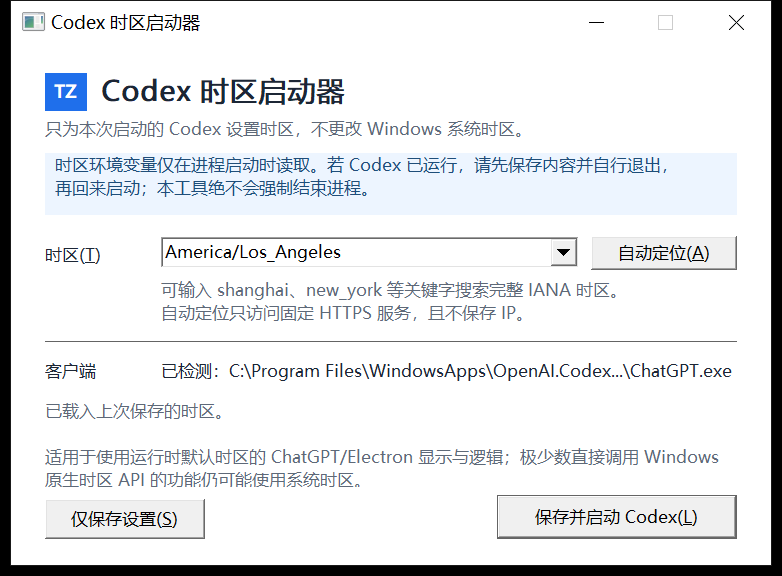

# Codex Time Zone Launcher

[](https://github.com/leihen08/codex-timezone-launcher/releases/latest)
[](#系统要求)
[](Cargo.toml)
[](LICENSE)

一个轻量、原生的 Windows 启动器。它在启动 Codex/ChatGPT 桌面客户端时，仅向新进程注入经过校验的 IANA `TZ` 环境变量，让 Electron/Node.js 的日期显示、格式化和相关运行时逻辑使用指定时区，同时不修改 Windows 系统时区。

当前版本：**v1.0.1**

> 本项目是非官方社区工具，与 OpenAI 没有关联，也不代表 OpenAI。Codex、ChatGPT 和 OpenAI 是其各自权利人的商标。



## 解决什么问题

Windows 的系统时区会影响整台电脑。开发、测试跨时区功能或临时查看另一个地区的时间时，直接修改系统时区可能干扰日志、日历、浏览器和其他应用。

本工具为一次 Codex/ChatGPT 桌面客户端启动设置独立的进程级时区：

- Windows 继续使用原来的系统时区；
- 仅新启动的 Codex/ChatGPT 进程及其子进程收到 `TZ`；
- 无须管理员权限；
- 不修改用户级或系统级环境变量；
- 不会强制结束已经运行的客户端。

## 重要能力边界

这个工具改变的是 **Electron/Node.js 进程运行时的时区**，不是 Windows 系统时区，也不是 Codex 服务端或模型的账户/任务时区。

- `Date`、`Intl.DateTimeFormat` 等尊重 `TZ` 的运行时逻辑通常会使用所选时区；
- 直接调用 Windows 原生时区 API 的功能仍可能使用系统时区；
- Codex 可能把 Windows 时区作为任务上下文发送给模型，因此直接询问“现在几点”时，模型仍可能回答 Windows 系统时区；
- 已经运行的客户端不会即时切换，必须完全退出后由本工具重新启动。

如果需要模型按指定时区回答，请在任务或项目指令中明确写出时区，例如：`请始终按 America/Los_Angeles 时区回答日期和时间。`

### 能力边界实测报告

以下结果来自 2026-09-07 的本机端到端测试：

| 测试项 | 实测结果 |
|---|---|
| 测试系统 | Windows 10 Pro 22H2，x64，Build 19045 |
| Codex Store 包 | `OpenAI.Codex 26.901.6511.0 x64` |
| 启动器选择 | `America/Los_Angeles` |
| 启动器设置文件 | 已保存 `America/Los_Angeles` |
| Codex 子进程继承的 `TZ` | `America/Los_Angeles` |
| Node.js `Intl.DateTimeFormat().resolvedOptions().timeZone` | `America/Los_Angeles` |
| Node.js 日期输出 | `GMT-0700`，北美太平洋夏令时间 |
| Windows 原生时区 | `China Standard Time` |
| Codex 任务提供给模型的时区上下文 | `Asia/Shanghai` |
| 向 Codex 询问当前时间 | 仍回答中国标准时间（UTC+8） |

**实测结论：** Store 激活和 `TZ` 注入成功，Electron/Node.js 进程层已经切换为洛杉矶时区；Codex 模型层仍采用主机提供的 `Asia/Shanghai` 上下文。这个限制不能通过继续增加普通环境变量来消除。

## 功能

- 完整 IANA 时区表，并支持不区分大小写的关键字搜索；
- 支持 `Asia/Shanghai`、`America/Los_Angeles`、`Europe/London` 等规范时区；
- 自动记忆上次选择，设置采用原子写入；
- 兼容迁移旧版 `TimeZoneName` 设置；
- 自动发现 Microsoft Store 版和常见桌面安装版客户端；
- 为 Microsoft Store 包使用 AUMID 激活和进程级环境注入；
- 自动定位当前公网 IP 对应的 IANA 时区；
- 自动定位仅访问固定 HTTPS 服务，不保存 IP；
- Store 启动和网络定位在后台执行，界面保持响应；
- 系统级单实例保护，重复打开时唤回已有窗口；
- 检测到客户端正在运行时给出提示，绝不强制结束进程；
- Per-Monitor V2 DPI 感知的原生 Win32 界面；
- 无安装程序、无后台服务，单个 EXE 即可运行。

## 下载

从 [GitHub Releases](https://github.com/leihen08/codex-timezone-launcher/releases/latest) 下载最新版：

- [CodexTimeZoneLauncher.exe](https://github.com/leihen08/codex-timezone-launcher/releases/download/v1.0.1/CodexTimeZoneLauncher.exe)
- [SHA256SUMS.txt](https://github.com/leihen08/codex-timezone-launcher/releases/download/v1.0.1/SHA256SUMS.txt)

本地发布构建没有商业代码签名证书，Windows 可能显示“未知发布者”。请从本仓库的 Release 下载，并使用随附的 SHA-256 文件核对完整性。

## 使用方法

1. 保存工作并完全退出正在运行的 Codex/ChatGPT 桌面客户端。
2. 下载并运行 `CodexTimeZoneLauncher.exe`。
3. 在时区框中输入 `shanghai`、`los_angeles`、`new_york` 等关键字。
4. 从结果中选择完整的 IANA 时区，或点击“自动定位”。
5. 点击“保存并启动 Codex”。

设置保存在：

```text
%LOCALAPPDATA%\ChatGPTTimeZoneLauncher\settings.json
```

设置仅包含所选时区，不保存公网 IP、客户端路径或账户信息。

## 系统要求

| 项目 | 支持情况 |
|---|---|
| 操作系统 | Windows 10 / Windows 11 |
| 架构 | x64（当前预编译 EXE） |
| 客户端 | Microsoft Store 版 Codex/ChatGPT，或常见桌面安装版 |
| 管理员权限 | 不需要 |
| macOS / Linux | 不支持 |

## 使用的技术

| 技术 | 用途 |
|---|---|
| Rust 2024 edition | 主程序、业务逻辑和安全边界 |
| `windows-sys` | Win32 UI、DPI、进程、注册表、AppModel、COM 和 WinHTTP |
| `chrono-tz` | 完整 IANA 时区数据库和规范校验 |
| `serde` / `serde_json` | 设置文件与定位响应解析 |
| Win32 原生控件 | 无 WebView、无额外 GUI 运行时 |
| WinHTTP | 固定 HTTPS 自动定位、系统证书校验和超时控制 |
| `IApplicationActivationManager` | 通过 AUMID 正确激活 Store 应用 |
| `IPackageDebugSettings` | 在 Store 包进程创建阶段注入临时 `TZ` 环境 |
| Rust/MSVC + Thin LTO | 生成体积小、启动快的 Windows x64 EXE |

### 普通桌面版启动

普通 EXE 使用 Rust `std::process::Command` 启动，并只在子进程环境中设置：

```text
TZ=America/Los_Angeles
```

启动器不拼接或执行 shell 命令。对于 `Codex.exe`，运行检测还要求路径与目标一致，以免把 Codex CLI 误判成桌面客户端。

### Microsoft Store 版启动

Store 应用不能可靠地通过受保护的 `WindowsApps` 内部 EXE 直接启动，而且普通 AUMID 激活不会继承每次启动设置的环境变量。因此本项目采用以下流程：

1. 发现 Store 包全名和 AUMID；
2. 创建一次性本地握手事件；
3. 通过 `IPackageDebugSettings` 注册只含 `TZ` 的临时环境块；
4. 使用 `IApplicationActivationManager` 激活 AUMID；
5. 由启动器的隐藏恢复模式恢复 Windows 暂停的启动线程；
6. 握手成功后立即撤销包调试设置。

所有错误路径都会尝试清理临时设置。项目不定义或调用包终止 API。

详细设计见：

- [ADR-001：原生进程级时区启动器](docs/decisions/0001-native-process-local-timezone.md)
- [ADR-002：Store 包环境激活](docs/decisions/0002-store-package-environment-activation.md)

## 自动定位与隐私

“自动定位”只请求固定端点 `https://ipapi.co/json/`：

- 只读取响应中的 `timezone` 字段；
- 不在设置、日志或界面状态中保存公网 IP；
- 禁止 HTTP 重定向；
- 使用 Windows 系统 TLS 证书校验；
- DNS、连接、发送和接收均有超时；
- 响应体上限为 64 KiB；
- 离线、超时、HTTP 错误、无效 JSON 和无效时区均有明确提示。

## 性能

v1.0.1 x64 Release 在开发机上的参考数据：

| 指标 | 结果 |
|---|---:|
| 冷启动到窗口出现 | 约 86 ms |
| 热启动中位数 | 约 45 ms |
| 空闲工作集 | 约 12.4 MiB |
| 私有内存 | 约 2.1 MiB |
| 空闲 CPU | 接近 0 |
| EXE 大小 | 约 424 KiB |

数据仅供参考，客户端启动速度和网络定位时间取决于电脑、网络与 Codex 版本。

## 从源码构建

要求：

- Windows 10/11 x64；
- Rust 1.98.1，由 `rust-toolchain.toml` 锁定；
- Visual Studio 2022 Build Tools；
- `Desktop development with C++` 工作负载和 Windows SDK。

安装构建依赖：

```powershell
winget install --id Rustlang.Rustup --exact
winget install --id Microsoft.VisualStudio.2022.BuildTools --exact --override "--wait --passive --add Microsoft.VisualStudio.Workload.VCTools --includeRecommended"
```

克隆并构建：

```powershell
git clone https://github.com/leihen08/codex-timezone-launcher.git
cd codex-timezone-launcher
./scripts/build-release.ps1
```

脚本依次执行格式检查、Clippy、全部测试和锁定依赖的 Release 构建，然后生成：

```text
outputs\CodexTimeZoneLauncher.exe
outputs\SHA256SUMS.txt
```

## 开发与验证

```powershell
cargo fmt -- --check
cargo clippy --locked --all-targets -- -D warnings
cargo test --locked
cargo build --release --locked
cargo audit --no-fetch
```

当前测试覆盖：

- 时区搜索、规范校验和非法字符处理；
- 设置记忆、原子写入和旧格式迁移；
- 客户端发现与 Codex CLI 误报规避；
- 已运行客户端的安全处理；
- 普通子进程环境隔离；
- Store 环境块、AUMID 分发和线程恢复握手；
- 单实例锁；
- 自动定位响应、大小限制和错误映射。

## 项目结构

```text
src/
├── config.rs             设置读取、迁移与原子写入
├── discovery.rs          桌面版和 Store 版客户端发现
├── geo.rs                固定 HTTPS 时区定位
├── process.rs            进程检测与普通 EXE 启动
├── single_instance.rs    系统级单实例锁
├── store_activation.rs   Store COM/AUMID 激活
├── store_launch.rs       Store 环境块与恢复握手
├── timezone.rs           IANA 时区校验和搜索
├── ui.rs                 Win32 窗口与消息循环
├── ui_app.rs             UI 状态和后台任务
├── ui_controls.rs        控件行为与颜色
├── ui_layout.rs          DPI 感知界面布局
└── workflow.rs           保存、检测和启动工作流
```

## 版本记录

当前稳定版本为 **v1.0.1**。完整变更见 [CHANGELOG.md](CHANGELOG.md)。

## 许可证

本项目使用 [MIT License](LICENSE)。
